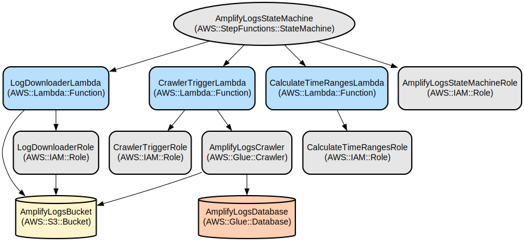

# AWS Amplify Logs Processor: Automated Log Collection and Analysis Pipeline

AWS Amplify Logs Processor is a serverless solution that automates the collection, storage, and analysis of AWS Amplify access logs. It provides a scalable, reliable way to gather logs across multiple Amplify applications and prepare them for analysis using AWS Athena.

The solution uses AWS Step Functions to orchestrate the log collection process, automatically handling time range calculations, parallel processing of multiple applications, and data preparation through AWS Glue. It features automatic retries, error handling, and configurable retention periods to ensure robust log collection.

## Repository Structure
```
hyl-amplify-logs/
├── amplify-stack-backup/          # Backup of complete CloudFormation stack
│   ├── extract-complete-stack.sh  # Script to extract stack components
│   ├── extracted_templates/       # CloudFormation templates
│   ├── extracted_lambda/         # Lambda function code and configurations
│   └── s3_backup/               # S3 bucket contents including CloudFormation templates
├── deploy_first.sh              # Main deployment script
├── create_eventbridge_rule.sh   # Script to create EventBridge trigger
├── docs/                        # Documentation and knowledge base
│   ├── athena/                 # Athena query examples
│   └── knowledge_base/         # Configuration and setup guides
├── local/                      # Local development and testing tools
│   └── amplify_logs.py        # Local log download script
└── tests/                     # Test events and configurations
    └── events/               # Sample test events for Lambda functions
```

## Usage Instructions
### Prerequisites
- AWS CLI installed and configured
- AWS account with permissions to create:
  - Lambda functions
  - Step Functions
  - IAM roles
  - S3 buckets
  - Glue resources
- Python 3.9 or later
- AWS credentials configured with appropriate permissions

### Installation

1. Clone the repository:
```bash
git clone [repository-url]
cd hyl-amplify-logs
```

2. Configure AWS credentials:
```bash
aws configure
```

3. Deploy the infrastructure:
```bash
chmod +x deploy_first.sh
./deploy_first.sh
```

4. Create the EventBridge trigger:
```bash
chmod +x create_eventbridge_rule.sh
./create_eventbridge_rule.sh
```

### Quick Start

1. Configure your Amplify applications in `config.json`:
```json
{
  "applications": [
    {
      "profile": "YOUR_PROFILE",
      "region": "YOUR_REGION",
      "appId": "YOUR_APP_ID",
      "domainName": "YOUR_DOMAIN",
      "appName": "YOUR_APP_NAME"
    }
  ],
  "s3": {
    "bucket": "XXXXXXXXXXXXXXXX",
    "prefix": "amplify_logs"
  },
  "timeChunkSize": 14,
  "logRetention": 30
}
```

2. Test the deployment:
```bash
aws stepfunctions start-execution \
  --state-machine-arn [STATE_MACHINE_ARN] \
  --input file://tests/events/step_functions_test_event.json
```

### More Detailed Examples

1. Download logs for a specific date range:
```python
from local.amplify_logs import AmplifyLogDownloader

downloader = AmplifyLogDownloader("config.json")
downloader.process_date_range("2024-01-01", "2024-01-31")
```

2. Analyze logs using Athena:
```sql
SELECT *
FROM "amplify_logs"."logs"
WHERE date_export >= '2024-01-01'
  AND date_export <= '2024-01-31'
```

### Troubleshooting

1. Lambda Function Failures
- Check CloudWatch logs for the specific Lambda function
- Verify IAM roles have correct permissions
- Ensure S3 bucket exists and is accessible

2. Step Functions Execution Failures
- Review the execution history in AWS Console
- Check individual Lambda function logs
- Verify input parameters are correctly formatted

3. Glue Crawler Issues
- Ensure S3 bucket contains log files
- Verify Glue service role permissions
- Check Glue database exists

## Data Flow
The solution processes Amplify logs through a coordinated pipeline of AWS services.

```
[EventBridge Rule] --> [Step Functions] --> [Calculate Time Ranges Lambda]
                                      --> [Log Downloader Lambda] --> [S3 Bucket]
                                      --> [Crawler Trigger Lambda] --> [Glue Crawler]
                                                                  --> [Glue Database]
```

Key component interactions:
1. EventBridge triggers Step Functions workflow on schedule
2. Calculate Time Ranges Lambda determines processing chunks
3. Log Downloader Lambda retrieves logs from Amplify API
4. Logs are stored in S3 with standardized prefix/path
5. Crawler Trigger Lambda initiates Glue crawler
6. Glue crawler updates table schema in Glue database
7. Data becomes queryable through Athena
8. Error handling and retries occur at each step

## Infrastructure


### Lambda Functions
- `amplifylogs-logging-intite-lm1`: Downloads Amplify logs
- `amplifylogs-pipeline-intite-lm1`: Triggers Glue crawler
- `amplifylogs-orchestration-intite-lm2`: Calculates time ranges

### IAM Roles
- `amplifylogs-logging-intite-ir1`: Log downloader role with Amplify and S3 access
- `amplifylogs-pipeline-intite-ir2`: Crawler trigger role with Glue access
- `amplifylogs-orchestration-intite-ir3`: Time range calculator role

### S3 Resources
- Bucket for storing Amplify logs with versioning and encryption
- Standardized path structure for log organization

### Glue Resources
- Crawler for processing log files
- Database for storing log metadata
- Table schema for Athena queries

### Step Functions
- State machine for orchestrating the log collection workflow
- Error handling and retry logic
- Parallel processing of multiple applications

## Deployment
1. Prerequisites:
- AWS CLI configured with admin permissions
- S3 bucket for CloudFormation templates
- Python 3.9+ for Lambda functions

2. Deployment Steps:
```bash
# Deploy infrastructure
./deploy_first.sh

# Create EventBridge trigger
./create_eventbridge_rule.sh
```

3. Environment Configuration:
- Set environment in deployment scripts (infdev/inftes/infpro)
- Configure log retention period
- Set up monitoring through CloudWatch

4. Monitoring:
- CloudWatch logs for Lambda functions
- Step Functions execution history
- Glue crawler status